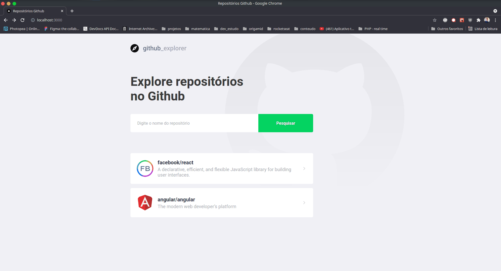

# Índice

- [Tecnologias Utilizadas](#tecnologias-utilizadas)
- [Como Usar](#como-usar)

<a id="tecnologias-utilizadas"></a>

## Tecnologias Utilizadas

O projeto foi desenvolvido utilizando as seguintes tecnologias

- [TypeScript](https://www.typescriptlang.org/)
- [Node.js](https://nodejs.org/en/)
- [ReactJS](https://reactjs.org/)

## Resultado Web

<h1 align="center">
    
</h1>

<a id="como-usar"></a>

## Como usar

- ### **Pré-requisitos**

  - É **necessário** possuir o **[Node.js](https://nodejs.org/en/)** instalado na máquina
  - Também, é **preciso** ter um gerenciador de pacotes seja o **[NPM](https://www.npmjs.com/)** ou **[Yarn](https://yarnpkg.com/)**.

1. Faça um clone :

```sh
  $ git clone https://github.com/psiubr/repos-github.git
```

2. Executando a Aplicação:

```sh
  # Inicie a aplicação web
  $ cd repos-github
  $ yarn
```
